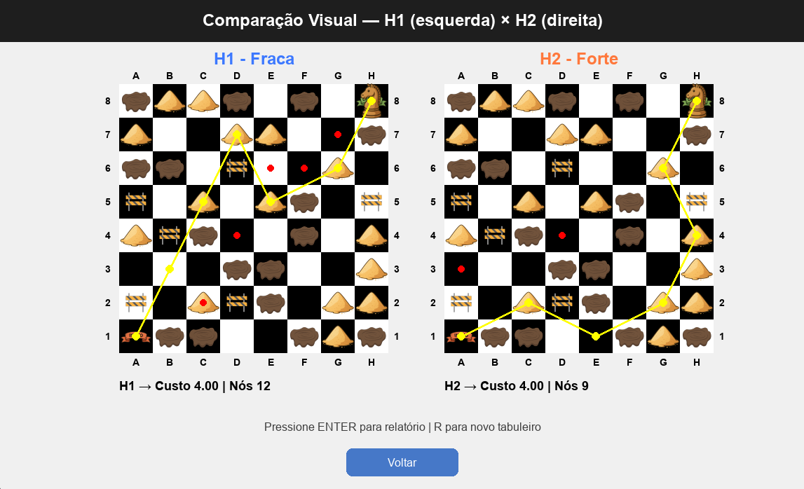

# ♞ Caminho do Cavalo — Algoritmo A\*

Projeto desenvolvido para a disciplina **Sistemas Inteligentes (IFPE)** com o objetivo de **implementar e visualizar o algoritmo A\*** na busca do **menor caminho de um cavalo em um tabuleiro de xadrez 8×8**, considerando diferentes tipos de terrenos e custos.

---

## 🧠 Objetivo do Projeto

O projeto visa demonstrar, de forma **visual e interativa**, os conceitos de **busca heurística informada** aplicados no algoritmo **A\***, comparando o comportamento de duas heurísticas:

- **H1 — Heurística Fraca:** baseada na distância de Chebyshev × custo mínimo.
- **H2 — Heurística Forte:** baseada no número mínimo de movimentos do cavalo × custo mínimo.

Através da interface gráfica (desenvolvida com **Pygame**), o usuário pode:

- Selecionar o tipo de heurística.
- Visualizar a expansão dos nós e o caminho ótimo.
- Comparar visualmente as heurísticas **H1 × H2**.
- Gerar relatórios automáticos com métricas de desempenho.

---

## ⚙️ Estrutura do Projeto

```
projeto-sistemas-inteligentes/
│
├── main.py                      # Ponto de entrada do sistema
├── src/
│   ├── busca_a_estrela.py       # Implementação do algoritmo A* e heurísticas
│   ├── tabuleiro.py             # Representação e regras do tabuleiro
│   ├── cavalo.py                # Classe Cavalo e movimentos possíveis
│   ├── interface_grafica.py     # Interface visual com menus e animações
│   ├── gerador_tabuleiro.py     # Geração aleatória de tabuleiros válidos
│   └── relatorio_custos.py      # Geração dos relatórios comparativos
│
├── assets/                      # Imagens (terrenos, ícones, cavalo etc.)
│
├── cenarios/
│   └── cenario_basico.json      # Exemplo de cenário fixo
│
├── tests/                       # Testes
│
└── README.md                    # Este arquivo
```

---

## 🧩 Pré-requisitos

Antes de rodar o projeto, é necessário ter instalado:

- **Python 3.10+** (recomendado: 3.12 ou 3.13)
- **Pip** (gerenciador de pacotes do Python)

Você pode verificar se estão instalados executando:

```bash
python --version
pip --version
```

---

## 📦 Instalação do Projeto

Clone este repositório:

```bash
git clone https://github.com/seu-usuario/projeto-sistemas-inteligentes.git
cd projeto-sistemas-inteligentes
```

Crie e ative um ambiente virtual (opcional, mas recomendado):

### Windows (PowerShell)

```bash
python -m venv venv
venv\Scripts\activate
```

### Linux / macOS

```bash
python3 -m venv venv
source venv/bin/activate
```

Instale manualmente os módulos necessários:

```bash
pip install pygame
```

---

## ▶️ Execução do Projeto

Para rodar a aplicação principal:

```bash
python main.py
```

Ao iniciar, será exibido o **menu principal** com as seguintes opções:

- **Tabuleiro Fixo** → Carrega o cenário `cenario_basico.json`.
- **Tabuleiro Aleatório** → Gera um tabuleiro novo a cada execução.
- **Comparar Heurísticas** → Executa simultaneamente H1 e H2 e mostra o comparativo visual.

---

## 🧭 Navegação na Interface

- **Cliques:** selecione as opções do menu.
- **Botão “Voltar”:** retorna à tela anterior.
- **Tecla `R`:** gera um novo tabuleiro aleatório durante a execução.
- **Tecla `ENTER`:** exibe o relatório analítico com métricas da busca.
- **Fechar janela:** encerra o programa.

---

## 📊 Relatórios Gerados

Durante a execução, o sistema gera relatórios sobre:

- Caminho encontrado e custo total.
- Nós expandidos e heurísticas usadas.
- Comparativo entre **H1 (fraca)** e **H2 (forte)**:
  - Número de nós expandidos.
  - Custo médio por nó.
  - Movimentos no caminho final.
  - Eficiência e informatividade relativa.

Exemplo de saída no modo comparativo:

```
=== RELATÓRIO COMPARATIVO DE HEURÍSTICAS ===

H1 (Fraca) - Custo Médio por Nó: 00.33 | Nós Expandidos: 12
H2 (Forte) - Custo Médio por Nó: 00.44 | Nós Expandidos: 9

📊 COMPARAÇÃO GERAL:
H2 expandiu 25.0% menos nós.
```

---

## 💡 Conceitos Demonstrados

O projeto comprova os seguintes princípios de **Sistemas Inteligentes**:

| Conceito                    | Aplicação                                               |
| --------------------------- | ------------------------------------------------------- |
| **Busca Heurística**        | Implementação do algoritmo A\*                          |
| **Admissibilidade**         | Nenhuma heurística superestima o custo real             |
| **Informatividade**         | H2 fornece uma estimativa mais precisa e eficiente      |
| **Visualização de Estados** | Interface gráfica interativa com expansão em tempo real |

---

## 🧪 Exemplos de Teste

| Tipo de Execução     | Descrição                              |
| -------------------- | -------------------------------------- |
| `modo = "fixo"`      | Usa o cenário `cenario_basico.json`    |
| `modo = "aleatorio"` | Gera um novo tabuleiro a cada execução |
| Modo Comparativo     | Compara visualmente **H1 × H2**        |

---

## 🖼️ Exemplo Visual

Exemplo:



---

## 👨‍💻 Autores

**[Kerlen Melo]** & **[Rafael Marques]**
Curso de Análise e Desenvolvimento de Sistemas — IFPE  
📅 2025
